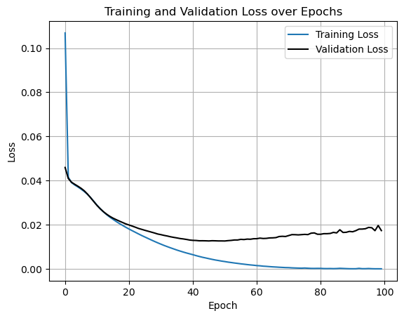
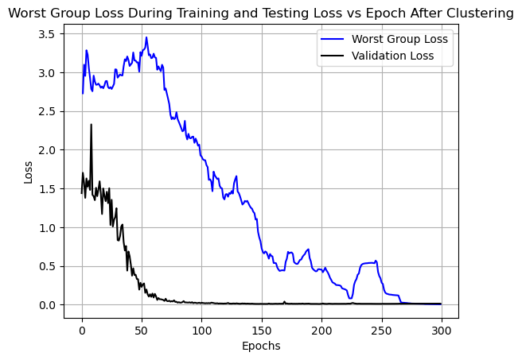
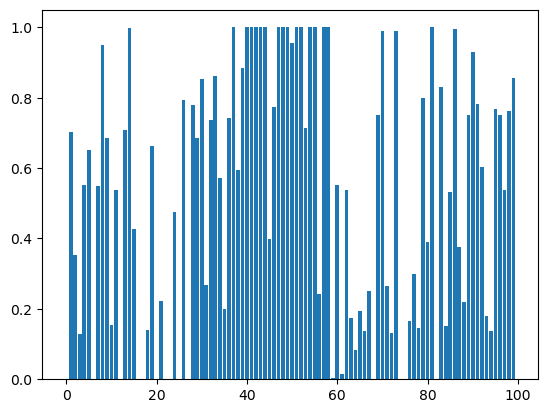
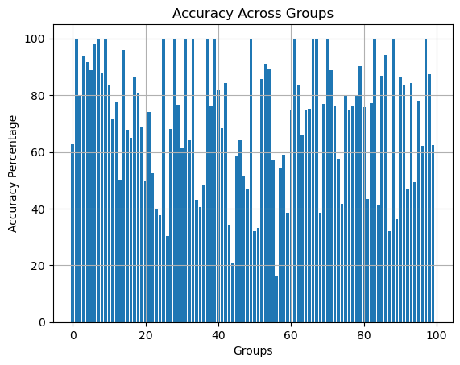
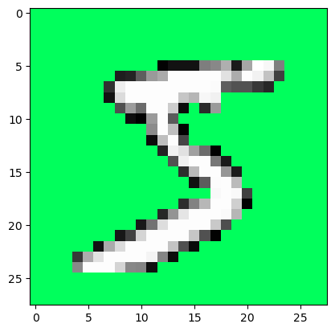

# GEORGE for Hidden Stratification: Recreated for BigML Lab Application

This repository recreates the GEORGE method from Sohoni et al. (2022) to address spurious correlations in a modified MNIST dataset, developed for my application to the BigML research group at UCLA.

# Abstract

Spurious correlation occurs when coarse-grained class labels obscure finer-grained subclasses, leading to poor model performance on critical subsets. This project recreates the GEORGE method from "No Subclass Left Behind" (Sohoni et al., 2022), applied to a modified MNIST dataset where each digit ($0-9$) has a primary background color $95%$ of the time and a secondary color $5%$ of the time, creating latent subclasses. Using PyTorch, I implemented GEORGE's two-step process: clustering features from an ERM-trained model and training a robust classifier with group DRO. My implementation improved robust accuracy (worst-case subclass accuracy) from $0$% (ERM) to $18$% (GEORGE), a $18$ point increase, demonstrating effective mitigation of spurious correlations.
# Table of Contents
- Background and Motivation
- Methods and Implementation
- Results and Discussion
- Visualizations
- Loss Over Epochs
- Sample Digits
- Reproducibility
- Citation
- Contact and Contributing
- License
- Acknowledgements

# Background and Motivation

The paper "No Subclass Left Behind" (Sohoni et al., 2022) tackles hidden stratification, a phenomenon where models trained on coarse-grained labels underperform on unlabeled subclasses, critical in applications like medical imaging. GEORGE addresses this by estimating subclass labels via clustering and optimizing worst-case performance with group DRO. I chose this paper for my BigML lab application to demonstrate my expertise in robust machine learning, PyTorch, and data analysis, aligning with the lab's focus on advancing ML robustness and fairness.

# Methods and Implementation
I implemented the GEORGE method on a modified MNIST dataset where each digit (0-9) has a primary background color (e.g., red for '0') 95% of the time and a secondary color (e.g., blue) 5% of the time, introducing hidden stratification. The task is to classify digits (0-9), with background colors as latent subclasses. The implementation, written in Python using PyTorch, follows GEORGE's two-step process across three Jupyter notebooks:

***Step 1: ERM Training and Feature Extraction (ERM.ipynb)*** 

Trained a convolutional neural network (CNN) using empirical risk minimization (ERM) to classify digits.
Extracted features from the penultimate layer for clustering. We use a batch size of 5 when training.
Saved model weights as model.pt.

***Step 2: Subclass Estimation (Clustering.ipynb)***

Applied UMAP dimensionality reduction to ERM features, followed by clustering to assign proxy subclass labels. Instead of using the Silhouette criterion, I found out through testing that using a set subcluster of 10 yielded the best results.
Generated cluster_labels.csv with cluster assignments for training and validation data.

***Step 3: Robust Training (GDRO.ipynb)***

Trained a new CNN using group DRO, minimizing worst-case loss over estimated subclasses from cluster_labels.csv.
Saved robust model weights as model2.pt.

***Dataset***

Training data: train_images.pt (images), train_labels.pt (digit labels).
Test data: test_images.pt, test_labels.pt.
The modified MNIST dataset was gotten using SpuCo package

***Model***

The CNN has 2 convolutional layers with the first layer being *9 x (5 x 5)* and the second layer being *18 x (5 x 5)*, with a maxpool window of *2 x 2* and one fully connected layers, trained with the AdamW optimizer (learning rate 0.001).
Clustering used UMAP and scikit-learn.

# Results and Discussions

The ERM baseline achieved *0*% robust accuracy (worst-case subclass accuracy) on 2 different groups and an under *20*% accuracy on 14 different groups, struggling with rare background color subclasses due to dataset imbalance. GEORGE achieved a robust accuracy to *18*% for 1 group and an under *20*% accuracy on only one group, an *18* point increase for robust accuracy and a *93*% reduction in group misclassifications under *20*%, by identifying and optimizing for these subclasses. This aligns with the paper's reported improvements (e.g., $22%$ on datasets like Waterbirds). Challenges included ensuring clustering captured small subclasses and managing DRO's computational cost. Limitations to the models performace include overclustering due to the fixed subcluster count instead of a dynamic one using a silhouette score. While the reason for doing this is sound-overclustering ensures that rare subgroups will be grouped properly compared to the silhouette score method-this also means that images that should be treated in the same group are treated differently during training, slowing down training.

# Visualizations
***Loss Over Epochs***

*Figure 1: Training and Testing loss for ERM*

*Figure 2: Worst Group and Testing loss for group DRO*

***Accuracy Over Groups***

*Figure 3: Accuracy for each group after training with ERM*

*Figure 4: Accuracy for each group after training with clustering and GDRO*

 

***Sample Digits***

*Figure 5: Digit with spurious correlation (background)*

# Reproducibility
To reproduce the results, ensure a Python environment with PyTorch, UMAP, scikit-learn, pandas, matplotlib, and seaborn. A GPU is recommended for faster training.
Clone the repository:
`git clone https://github.com/sanjaydbom/george`

Install dependencies:
`conda env create -f environment.yml`
`conda activate george`

[Note: Create environment.yml with dependencies; see example below.]
Run the notebooks in order:

ERM Training: Open ERM.ipynb and execute all cells to train the ERM model and save model.pt.
Clustering: Open Clustering.ipynb, ensure erm_weights.pt and train_images.pt/train_labels.pt are in the root directory, and run to generate cluster_labels.csv.
GDRO Training: Open GDRO.ipynb, ensure cluster_labels.csv and gdro_weights.pt are available, and run to train the GEORGE model and save model2.pt.

Evaluate results:

Use GDRO.ipynb's evaluation section to compute robust accuracy on test_images.pt and test_labels.pt.

The modified MNIST dataset is provided as train_images.pt, train_labels.pt, test_images.pt, and test_labels.pt. Ensure all files are in the repository root.
Example environment.yml
name: george-mnist
channels:
  - defaults
  - pytorch
  - conda-forge
dependencies:
  - python=3.8
  - pytorch=2.0
  - torchvision
  - umap-learn
  - scikit-learn
  - pandas
  - matplotlib
  - seaborn
  - jupyter
  - pip
  - pip:
      - notebook

# Citation

["No Subclass Left Behind: Fine-Grained Robustness in Coarse-Grained Classification Problems"](https://arxiv.org/abs/2011.12945)

["UMAP: Uniform Manifold Approximation and Projection for Dimension Reduction"](https://arxiv.org/abs/1802.03426)

# Contact and Contributing

For feedback or questions, contact Sanjay Dhamodharan at sanjayd@g.ucla.edu or open a GitHub Issue.

# License

This project is licensed under the MIT License

# Acknowledgements

Thanks to Sohoni et al. for their pioneering GEORGE method, the BigML research group at UCLA for inspiring this project, and PyTorch, UMAP, scikit-learn, and pandas for enabling the implementation.

